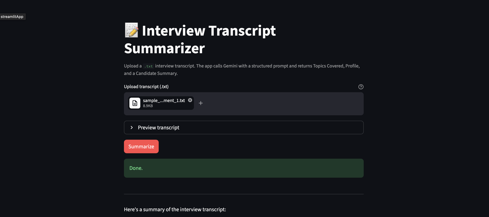
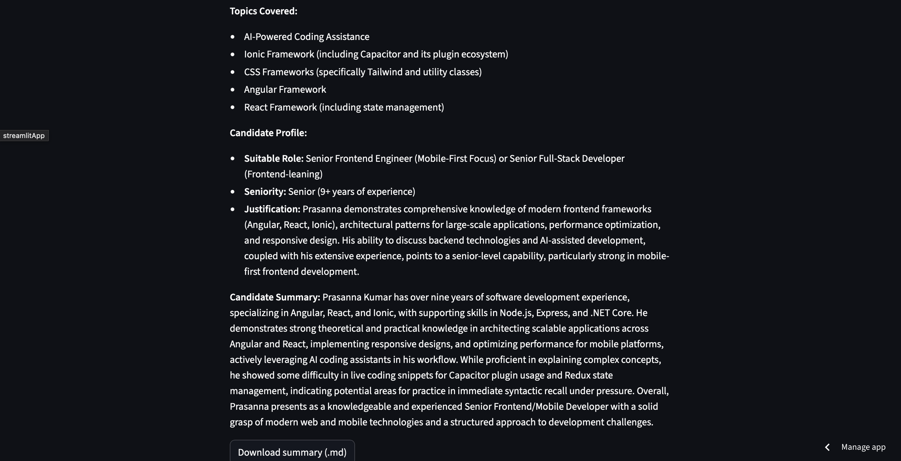

# Interview Transcript Summarization using Prompt Engineering

## Live Demo

Streamlit Deployment Link:  
https://interview-transcript-summarization.streamlit.app

---

## How to Run the Script

### Clone the Repository

```bash
git clone https://github.com/AjayKumar-KK/Interview-Transcript-Summarization-using-Prompt-Engineering.git
cd Interview-Transcript-Summarization-using-Prompt-Engineering
```

### Install Dependencies

```bash
pip install -r requirements.txt
```

### Add API Key

Create a `.env` file in the root directory:

```env
GOOGLE_API_KEY=your_api_key_here
```

### Run the Application

```bash
streamlit run app.py
```

---

## LLM Provider and Model Used

| Provider | Model |
|---|---|
| Google AI Studio | Gemini 2.5 Flash |
---

## Short Reflection

One surprising observation during this project was how much the output quality changed with small prompt modifications. Early prompts produced summaries that were accurate but generic, while later refinements improved structure, clarity, and recruiter-focused language significantly.

If given another day, I would improve the project by testing few-shot prompting and creating an evaluation framework to compare output consistency across transcripts. I would also explore handling longer transcripts more effectively.

One limitation of the final prompt is that the output quality still depends heavily on the clarity and completeness of the interview transcript. If the transcript lacks detail, the generated assessment may become less precise.

---

## Output Image

<p align="center">
  
  
</p>

<p align="center">
  <b>Streamlit Application Interface</b>
</p>

---

# Tech Stack

- Python
- Streamlit
- Google Gemini API
- Prompt Engineering
- Large Language Models (LLMs)

---
